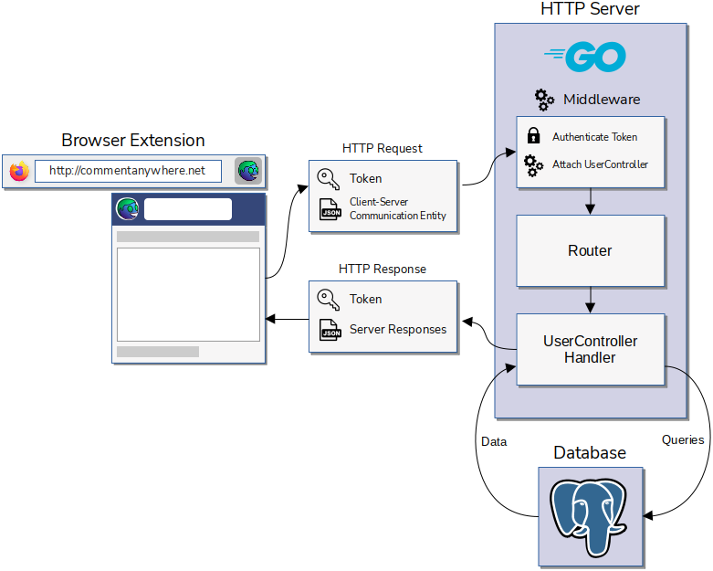

# CONTENTS

- **Title Page**

- **Instructor Comments & Evaluation**

- **Table of Contents**

- **Introduction**
  
  - Project Overview
    
    - Comment Anywhere is a browser extension for Mozilla Firefox that provides a fast and convenient way for users to create, view, and interact with comments on any webpage they visit on the Internet. Our back end server manages a secure database of these comments, user accounts, and necessary metadata. Comment Anywhere also provides moderation tools for removing objectionable content.
  
  - Motivation
    
    - Internet denizens have long found ways to have vibrant communications about a wide variety of content. In the past, more websites supported these conversations through comment sections, but many have shuttered their comment sections in recent years. Instead, the avenues of discourse have become social media sites such as Twitter, Facebook, Reddit, and bulletin board style forums, decoupling the conversation from the content itself.
    
    - While these sites may have a higher quantity of overall content than a given news site, they lend themselves to agendas and one-size-fits-all moderation policies while, at the same time, fragmenting the conversation and diluting information available to viewers of the core content. The conversation about a given point of interest on the Internet becomes dispersed among any number of social media posts, thereby burying much valuable information and well formulated alternate views. While it is usually trivial to move from a conversation on social media to the content discussed, it is much more difficult to move from the decoupled conversation.
    
    - There is a usefulness and market desire to see comment sections closely coupled with the content, that will follow the content wherever it goes. Comment Anywhere achieves this by permanently tying a comment section with a given URL and making those comments available immediately to users as they browse the web through a browser extension. We provide a unique comment section for every unique domain and path combination on the Internet, allowing users to offer feedback and insights on under-commented areas of the Internet, especially news sites, but also government and business websites.
  
  - Philosophy
    
    - Freedom of expression and whatnot.
  
  - Innovations over Existing Comment Providers
    
    - Comment sections are typically embedded into the web service itself, and moderated by one, possibly biased, organization. Granted, if said organization provided this feature at all.
    
    - Comment Anywhere provides a comment section for any webpage using one ubiquitous implementation, where comments are associated with nothing more than the webpage's URL itself. Users may even view and create comments on websites that do not support this communicative feature in the first place.
    
    - Due to this unique design, we provide two types of moderator accounts. Domain Moderators may only moderate comments on their assigned domain(s), whereas Global Moderators moderate comments across all domains.
    
    - Most comment sections only provide one dimension of voting: "like" or "dislike". This is the case for most popular social media sites, such as Reddit, Twitter, and YouTube. Facebook does offer more dimensions to vote on, however, the ability to sort is negligent.
    
    - Comment Anywhere provides each comment with three voting dimensions: "funny", "factual", and "agree". Members may vote on each dimension at most once, and may easily sort comments based on said dimensions.

- **Social Implications & Intended Audience**

- **System Block Diagram**
  
  
  
  - Figure 1.1 outlines the communicational process between the client-side browser extension and server-side HTTP server. When the user interacts with the browser extension (e.g. requesting to log in, changing a setting, posting a comment, etc.), an HTTP request is sent to the server's static IP address, containing the user's token, and a JSON (JavaScript Object Notation) of relevant data for that particular request.
  - Once the server receives the HTTP request, it will authenticate the token, and attach the relevant UserController (e.g. Guest Controller, Member Controller, Domain Moderator Controller, Global Moderator Controller, or Admin Controller). Next, the Router will select the relevant UserControllerHandler to invoke.
  - The selected UserControllerHandler will query the database for relevant data, compile a list of server responses, and emit those responses back to the client.
  - Once the client receives this HTTP response, it will invoke the necessary changes for 

- **Implementation Details**
  
  - Design Document Deviations
  
  - Schema Changes
  
  - Communication Entity Changes
  
  - Token Transmission
  
  - Module Database Utilization

- **Implementation Challenges**
  
  - "Dockerizing" the HTTP Server
  
  - Getting the URL
  
  - Debugging the Extension
  
  - Testing

- **Software Engineering Principles**
  
  - Waterfall Methodology
  
  - Modularity & Encapsulation
  
  - Abstractions
  
  - Separation of Concerns

- **Users Manual**
  
  - Standalone Application
  
  - Installation Instructions

- **References**

- **Table of Index**

- **Glossary**

- **Appendix**
  
  - Contacts
  
  - Frequently Asked Questions
  
  - Team Details and Contributions
  
  - Workflow Authentication
  
  - Code Listing
